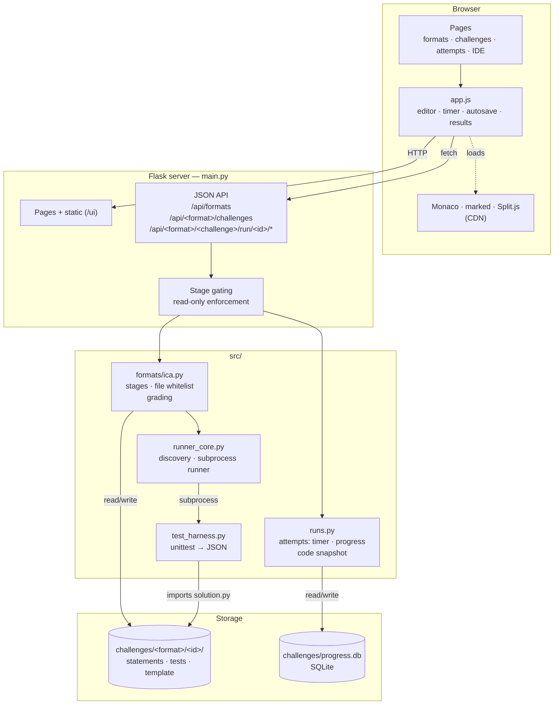
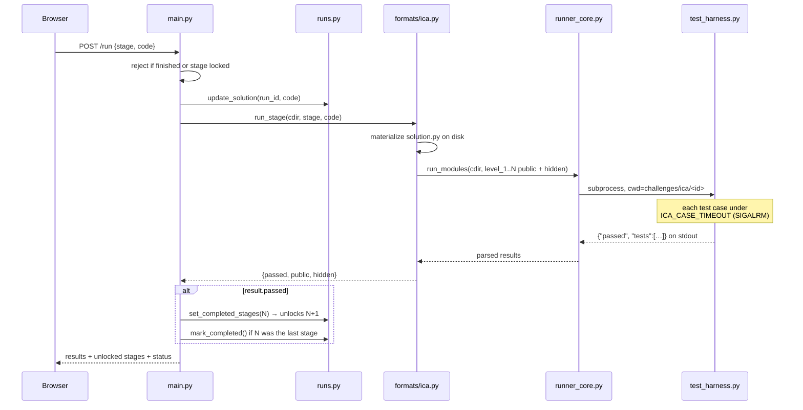
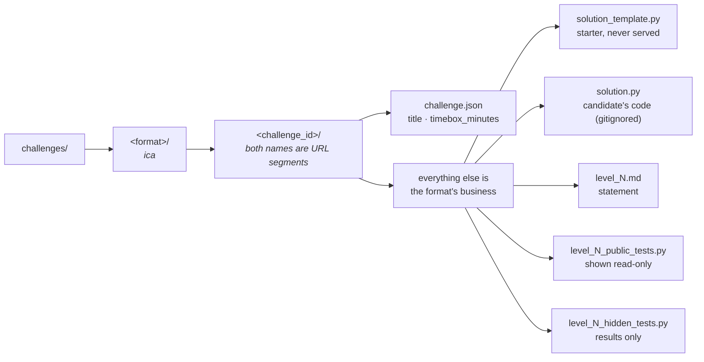

# Components

How the pieces fit together. The core is format-agnostic; an assessment format (ICA
today) plugs into it. See `README.md` for setup and `AGENTS.md` for working rules.

## System overview

The server is the only place that knows what is unlocked. The browser renders what it
is given; it never decides access.

## Responsibilities

| Component | Owns | Never does |
|---|---|---|
| `main.py` | Routing, stage gating, read-only enforcement, response shapes | Anything format-specific — no filenames, no "level" |
| `formats/ica.py` | Level layout, which files are visible, the pass/fail gate | Persistence, HTTP, knowing where the library lives |
| `runner_core.py` | Format + challenge discovery, spawning the harness | Persistence, format vocabulary |
| `runs.py` | Attempt rows: timer, progress, code snapshot, schema migration | Anything HTTP-aware |
| `test_harness.py` | Isolated subprocess: per-case time budget, output capture, JSON | Touching the DB |
| `ui/app.js` | Editor, tabs, timer display, autosave, result rendering | Deciding what is unlocked, or naming a stage itself |

## Running the tests for a stage

`main.py` never inspects `public`/`hidden` — the format decides `passed` and the rest is
passed through to the client. Hidden test **sources** never leave the server.

## Attempt lifecycle

The clock accumulates only while an attempt is *running*, so leaving the page pauses it.
The timebox is a target, not a lock: an in-progress attempt past its limit stays editable
and is simply flagged as over time. Completed attempts are read-only, enforced server-side.

## Challenge library

Only `challenge.json` is a core requirement; the ICA layout below it is defined by
`formats/ica.py`, which discovers levels by globbing `level_*_public_tests.py`. Adding a
challenge means creating a folder — there is no list to maintain anywhere.

## Trust boundaries

| Served to the browser | Never served |
|---|---|
| Statements of unlocked stages | Statements of locked stages |
| Public test sources | Hidden test sources |
| Your `solution.py` | `solution_template.py` |
| Hidden test *results* (names + status) | — |

Enforced by the format's `read_file` whitelist (for ICA, `solution` and `public-<n>` are
the only addressable file ids) plus per-stage checks in `main.py`. Candidate code runs in
a subprocess with **no sandboxing** — keep the server on `127.0.0.1`.
