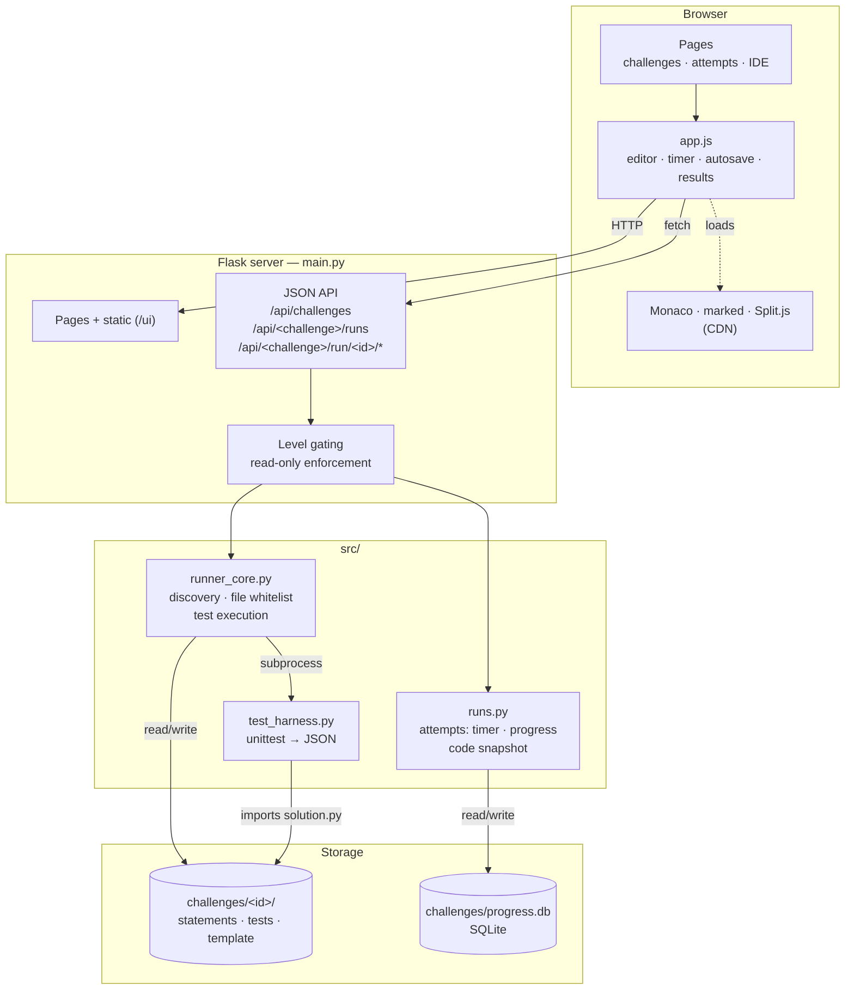
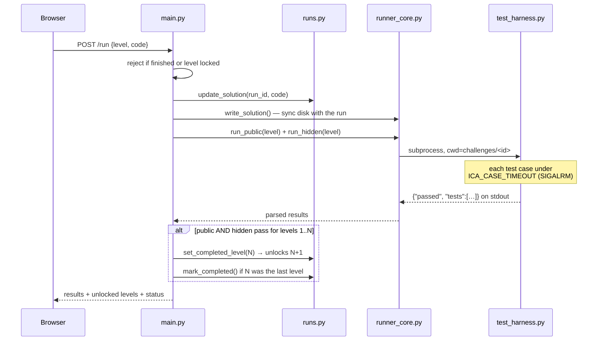
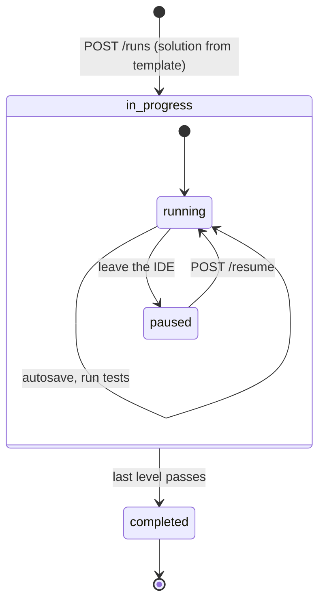
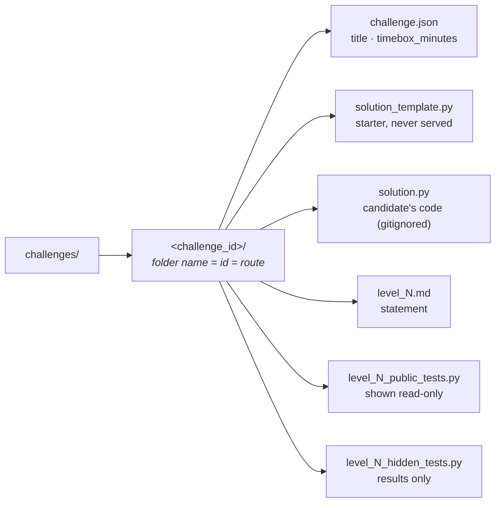

# Components

How the pieces of the ICA Mock Assessment fit together. See `README.md` for setup and
`AGENTS.md` for working rules.

## System overview

The server is the only place that knows what is unlocked. The browser renders what it
is given; it never decides access.

## Responsibilities

| Component | Owns | Never does |
|---|---|---|
| `main.py` | Routing, gating, read-only enforcement, response shapes | Business logic of test running |
| `runner_core.py` | Challenge discovery, whitelisted file reads, spawning tests | Persistence |
| `runs.py` | Attempt rows: timer, progress, code snapshot, schema migration | Anything HTTP-aware |
| `test_harness.py` | Isolated subprocess: per-case time budget, output capture, JSON | Touching the DB |
| `ui/app.js` | Editor, tabs, timer display, autosave, result rendering | Deciding what is unlocked |

## Running the tests for a level

Hidden test **sources** never leave the server — only their pass/fail results do.

## Attempt lifecycle

The clock accumulates only while an attempt is *running*, so leaving the page pauses it.
The timebox is a target, not a lock: an in-progress attempt past its limit stays editable
and is simply flagged as over time. Completed attempts are read-only, enforced server-side.

## Challenge library

Levels are discovered by globbing `level_*_public_tests.py`, and a challenge registers
itself simply by having a `challenge.json` — there is no list to maintain anywhere.

## Trust boundaries

| Served to the browser | Never served |
|---|---|
| Statements of unlocked levels | Statements of locked levels |
| Public test sources | Hidden test sources |
| Your `solution.py` | `solution_template.py` |
| Hidden test *results* (names + status) | — |

Enforced by a whitelist in `runner_core` (`solution` and `public-<n>` are the only
addressable file ids) plus per-level checks in `main.py`. Candidate code runs in a
subprocess with **no sandboxing** — keep the server on `127.0.0.1`.
